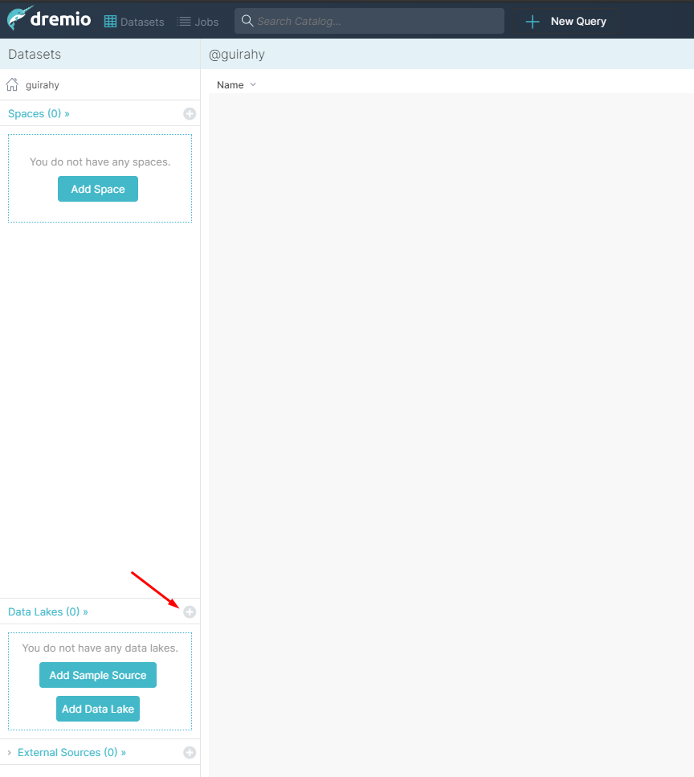
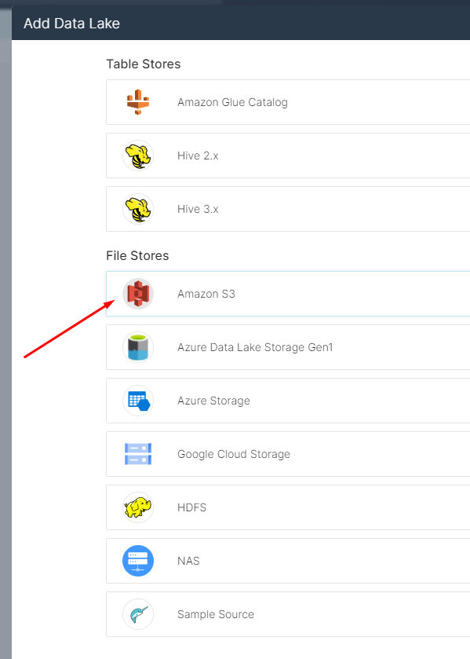
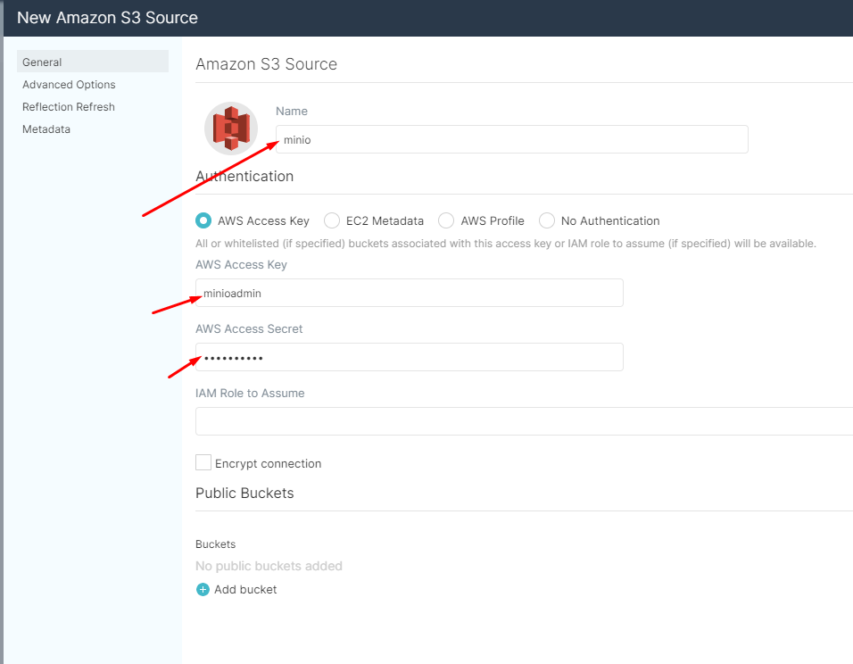
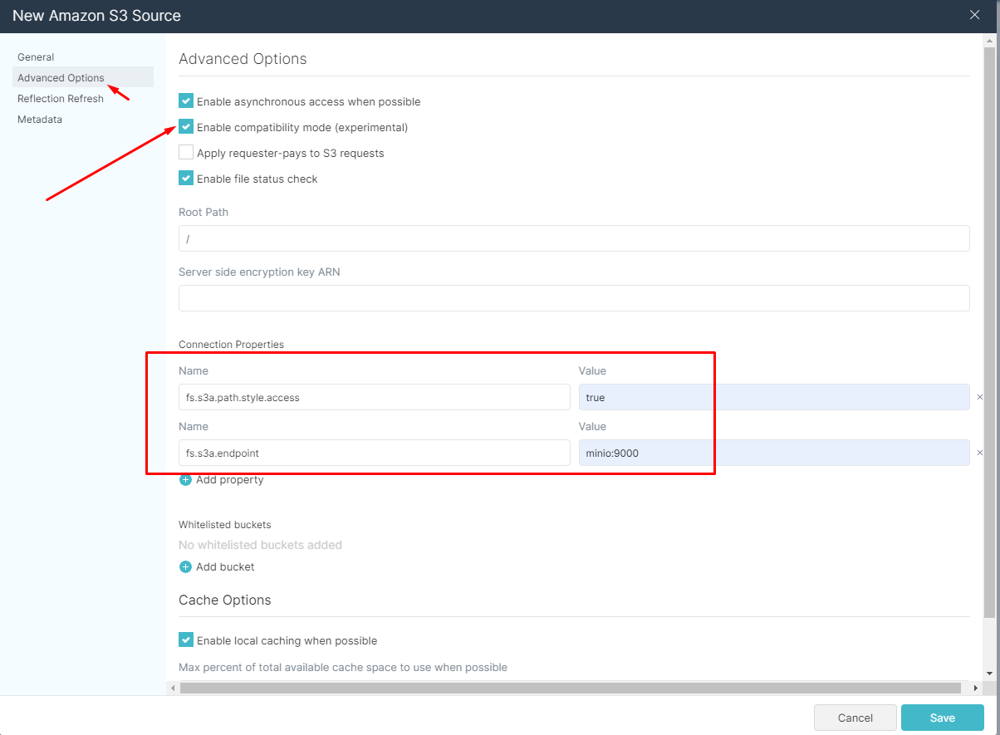

## To run docker compose exec
```bash
docker-compose up -d
```
### Permissions
Remember to grant right pertimission to volumes (``~/data/dremio``) refereces by docker compose file.

### URLs
* UI Console Dremio: http://localhost:9047
* UI Console MinIO: http://localhost:9001 (usr: minioadmin, pass: minioadmin)

## To access minio by AWS CLI

### Config AWS CLI
```bash
aws configure --profile s3local
```
* ``AWS Access Key ID [None]: minioadmin``
* ``AWS Secret Access Key [None]: minioadmin``
* ``Default region name [us-east-2]: us-east-2``
* ``Default output format [json]: json``

### Test list buckets
```bash
aws --endpoint-url http://127.0.0.1:9000 s3 ls --profile s3local
```

## Config DremIO access MinIO
https://docs.dremio.com/data-sources/s3/#configuring-s3-for-minio

1. Create Datalake



2. Select Source



3. Connect Config



4. Advanced Config



